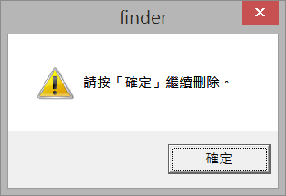

# 說明
這是一個增進和同事、朋友之間的惡作劇程式。

# 功能
UI顯示刪除程式。

實際上是讀取硬碟的所有目錄(列在左邊)，並且把目標副檔名(預設為.doc)的檔案給列出來(列在右邊)。

# 修改

## 關閉程式

目前放在github上的版本，是可以正常關閉的版本。

要修改成惡作劇的情況，造成更嚴重的恐慌，可以依下列步驟修改，成為無法正常關閉的程式。

finderDlg.cpp

line 294 解除註解
~~~
// 	AfxMessageBox("請按「確定」繼續刪除。");
~~~

line 327 加上註解
~~~
CDialog::OnClose();
~~~

改完的效果，直接關閉程式會得到這樣的訊息

必須使用工作管理員才可以關閉

## 修改目標副檔名

由於不同的朋友會關心電腦裡不同的檔案，所以，特別說一下如何修改目標副檔名。

finderDlg.cpp: line 191
~~~
const CString filetype("*.doc");  //target file
~~~
將doc改成任何的其它已知的副檔名即可。

